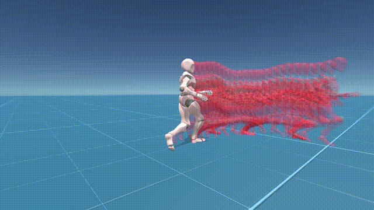
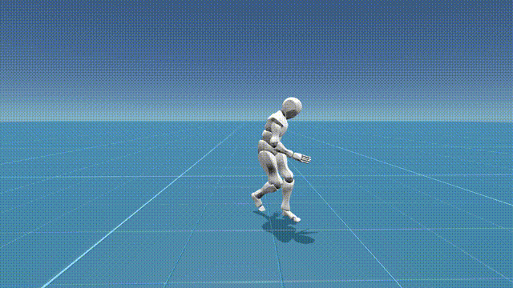
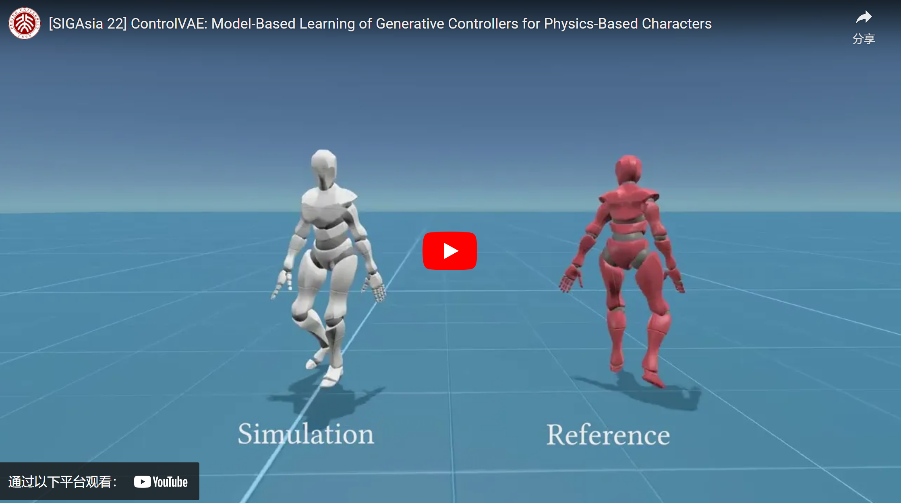

<p align=center>
 </img>
</p>


# ControlVAE: Model-Based Learning of Generative Controllers for Physics-Based Characters

[Heyuan Yao](https://heyuanyao-pku.github.io/), [Zhenhua Song](http://songzhenhua.cn/), [Baoquan Chen](https://cfcs.pku.edu.cn/baoquan/), [Libin Liu](http://libliu.info/)

***
A reimplemention of Siggraph Asia 2022 paper [ControlVAE: Model-Based Learning of Generative Controllers for Physics-Based Characters](https://heyuanyao-pku.github.io/Control-VAE/).

Please note that we are not able to guarantee that the codes will work if it is run with settings that we did not intend when we developed for the project. We would appreciate it if users could report the problems when they find it.

## Install

build conda from `requirements.yml`

```
conda env create -f requirements.yml
conda activate control-vae
conda install pytorch=*=*cuda* torchvision torchaudio cudatoolkit=11.3 -c pytorch
pip install panda3d
```

You should change into the folder of this project, and run
```
pip install -e .
cd ModifyODESrc
pip install -e .
```

Then be sure that your pytorch version >= 11.0, because we need torch.linalg.cross to accelerate code...


## Training

Our code needs mpi4py. The main process will be used to train the network and the rest process will be used to collect simulation data. You can simply run:
```
mpiexec -n 5 python train_controlvae.py --YOUR_ARGS
```

You do not need `YOUR_ARGS` by default.

Before training, we convert bvh files into a pickle file. You can build your own pickle by running

```
python build_motion_dataset.py
```

## Playing

We offer two tasks now: `random` sampling,  and `joystick` control. Both of them are in in the folder `PlayGround` and can be played by directly run the code.

We offer a panda viewer. The camera can be controled with mouse, and you can throw box to character by pressing 'b' or 'SPACE'.

For joystick control, the character is controler with `wasd` for direction and `123` for speed. The direction is relative to camera's forward direction.

> press `asd` continously....
> A known issue is that in some computer, the left/right direction is opposite... this maybe caused by the different loading methods of the gltf model

For example, you can run `PlayGround\random_playground.py`, which will ask for a config file(yml) and a trained parameters(.data). The pretrained model can be obtained from

```
OneDrive:
https://1drv.ms/u/s!AhVw0PSSGV0TmSfCdXQO7iwTyFwN?e=wKelcs

https://disk.pku.edu.cn/link/AAF42D48E8B96945B68F046576406C02D0
文件夹名：PretrainedModel
有效期限：2028-04-29 18:56
```

please download the config and data files into `Data\Pretrained`, and run.

```python
python PlayGround\random_playground.py
# select yml and controlvae.data
python PlayGround\joystick_playground.py
# select yml and joystick.data
```


# Citation

```bib
@article{
    ControlVAE,
    author = {Yao, Heyuan and Song, Zhenhua and Chen, Baoquan and Liu, Libin},
    title = {ControlVAE: Model-Based Learning of Generative Controllers for Physics-Based Characters},
    year = {2022},
    issue_date = {December 2022},
    volume = {41},
    number = {6},
    url = {https://doi.org/10.1145/3550454.3555434},
    journal = {ACM Trans. Graph.},
    articleno = {183},
}
```

[](https://star-history.com/#heyuanYao-pku/Control-VAE&Date)

## Some demos:

Prediction of world model:
<p align=center>
 </img>
</p>

***

Random sampling in the latent space

<p align=center>
 </img> </img>
</p>

***

Speed/Style and direction control:

<p align=center>
 </img> </img>
</p>

***

Resistance to external perturbations:

<p align=center>
 </img> </img>
</p>

***

<p align=center>
<a href="https://www.youtube.com/watch?v=ELZ7m4rLCgk">

</a>

</p>
